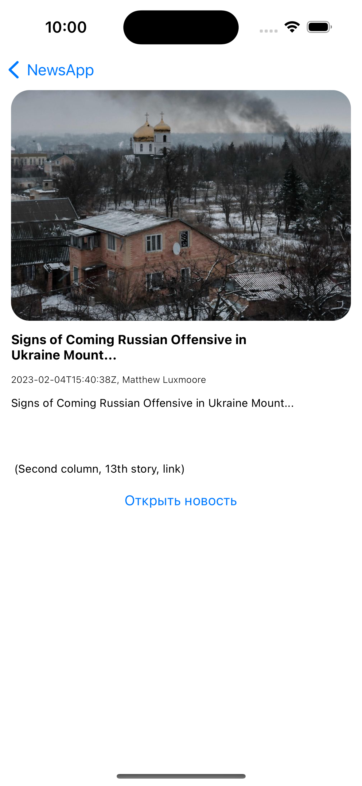

# TiNewsApp
Приложение для отображения новостей. Сторонние библиотеки не используются.

# Возможности
 - Отображение новостей с API сервиса
 - Возможность посмотреть деталку новости
 - Возможность открыть WebView для конкретной новости и посмотреть ее в источнике
 - Пагинация
 - Кеширование картинок (NSCache)
 - Архитектура - MVVM
 - Верстка без использования StoryBoard
 
# Скриншоты

 
 

 
